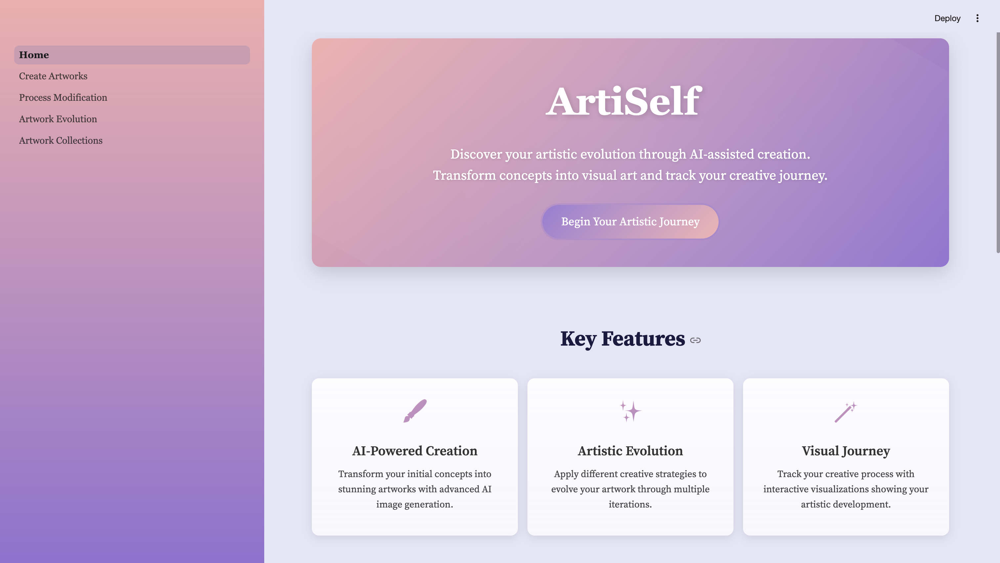
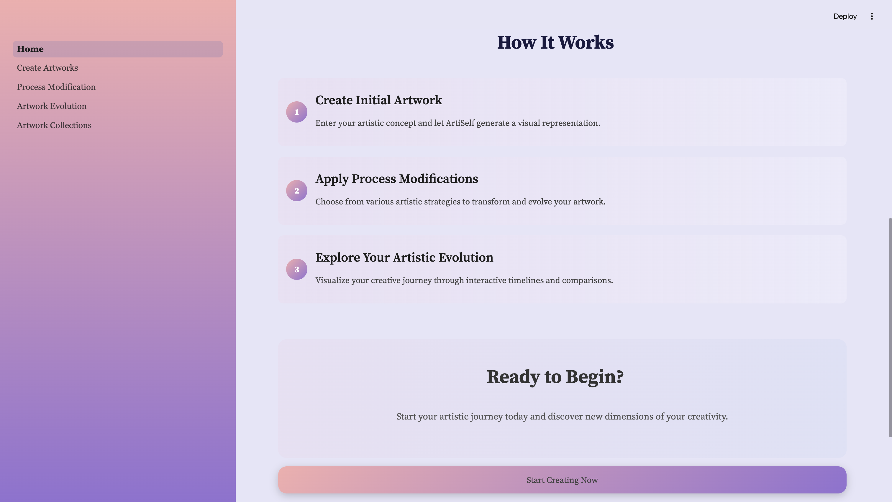
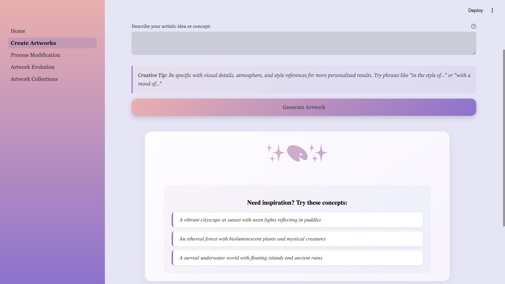
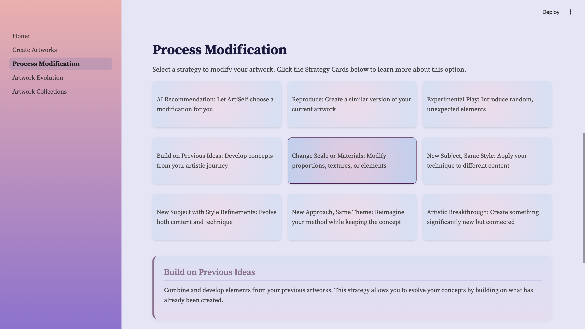
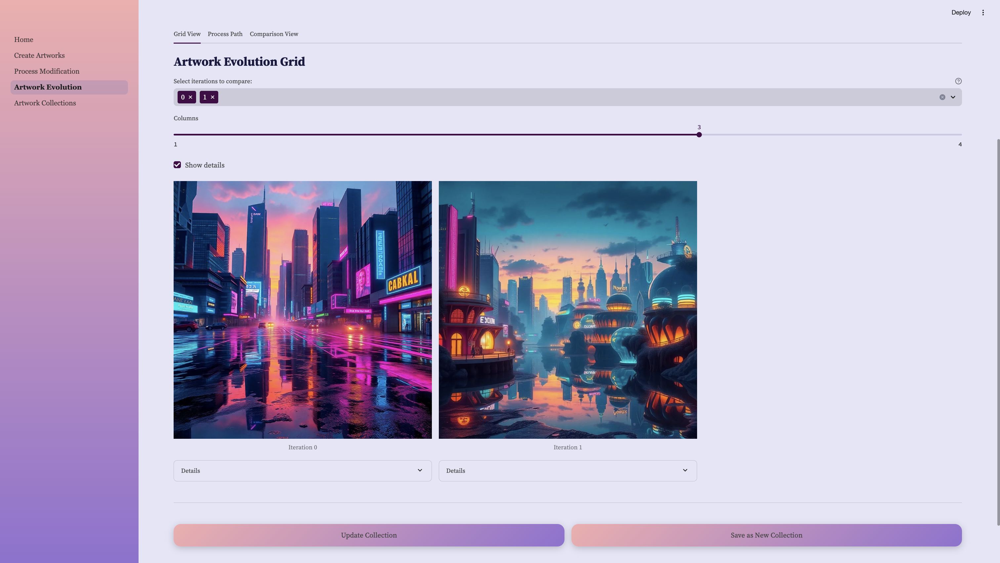
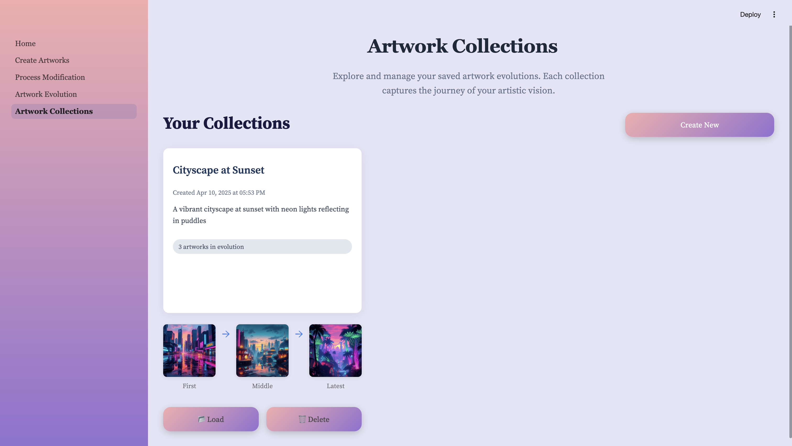

# ArtiSelf

An AI-powered art creation and evolution application built with [Streamlit](https://streamlit.io/). It uses multiple image generation backends and a graph-based approach for iterative concept development. The app allows users to:

1. Create initial artworks from a prompt  
2. Automatically refine concepts  
3. Apply various creative modification strategies  
4. Visualize iteration history and compare different versions
5. Save and manage artwork evolution collections



---

## Features

- **Multiple Generator Backends**  
  Uses Replicate, Craiyon, and Stability AI to produce images based on textual concepts. Handled by separate classes under image_generators.

- **Art Modification Engine**  
  Implements different "strategies" for evolving artwork, defined in modification_engine.py. Each strategy applies a unique prompt transformation before generating a new image.

- **Timeline Visualization**  
  The `TimelineVisualization` class in timeline_visualization.py provides views for:
  - Grid comparison  
  - Process path via a directed graph  
  - Side-by-side iteration comparison  

- **Artwork Collections**  
  Save complete artwork evolution journeys as collections that persist between sessions. Browse, load, update, and manage saved collections.

- **Session State Management**  
  Stores iteration history in Streamlit session state to keep track of all past artworks, concepts, and modifications.

---

## Application Screenshots

### Home Page


### Create Artworks
Enter your artistic concept and generate an initial artwork.


### Process Modification
Apply different creative strategies to evolve your artwork.


### Artwork Evolution
Visualize your artistic journey and track your creative development.


### Collections Management
Save, load, and manage your artwork evolution collections.


---

## Folder Structure

```
├── .streamlit
│   └── config.toml                # Streamlit configuration
├── assets                         # Screenshot images
├── collections                    # Saved artwork collections
│   └── README.md                  # Documentation on collection structure
├── pages
│   ├── 01_Create_Artworks.py      # Creates initial artworks
│   ├── 02_Process_Modification.py # Applies modification strategies
│   ├── 03_Artwork_Evolution.py    # Visualizes artwork timeline
│   └── 04_Artwork_Collections.py  # Manages saved collections
├── styles
│   └── styles.py                  # Custom CSS styling for the app
├── utils
│   ├── art_graph.py               # Graph-based concept refining
│   ├── collection_util.py         # Collection management utilities
│   ├── image_analysis.py          # AI-based image analysis
│   ├── image_generators           # Image generator classes
│   ├── modification_engine.py     # Main engine for art modifications
│   └── timeline_visualization.py  # Art evolution visualization
├── Home.py                        # Main landing page for Streamlit
└── requirements.txt               # Package requirements
```

---

## Setup

1. Clone this repository.  
2. Run:
   ```bash
   pip install -r requirements.txt
   ```
3. Set up environment variables (like `REPLICATE_API_TOKEN`, `STABILITY_API_KEY`) in a .env file following the examples in the code.

---

## Usage

1. Launch the Streamlit application:
   ```bash
   streamlit run Home.py
   ```

2. Use the sidebar to navigate between:
   - **Home**: Start page  
   - **Create Artworks**: Enter a prompt to generate an artwork  
   - **Process Modification**: Modify existing artwork with different strategies  
   - **Artwork Evolution**: Visualize the full timeline of creations and modifications
   - **Artwork Collections**: Manage saved artwork evolution collections

3. Working with Collections:
   - Save your artwork evolutions as named collections
   - Load collections to continue working on previous artwork evolutions
   - Update existing collections with new modifications
   - Browse and manage your saved collections

---

## Contact
For any questions, suggestions, or collaborations, feel free to reach out: ruhanyin0725@gmail.com